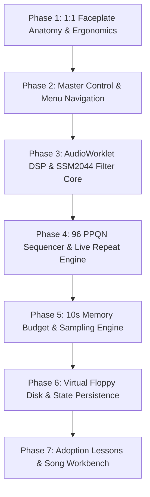

# Change: Build Order — 1:1 E-mu SP-1200 Phasing & Decision Matrix

## Strategy & Operating Protocol
- **Guiding Mandate:** Build a 1:1 functional software replica of the E-mu SP-1200.
- **Verification Rule:** Every phase must build cleanly (`pnpm build`), pass type checks, and be testable in the browser before advancing to the next phase.
- **Traceability:** Any engineer picking up this repository can check the current stage, verify the binary decision tree, and execute the next task without ambiguity.

---

## The Master Phase Roadmap

---

### Phase 1: 1:1 Faceplate Anatomy & Ergonomics (Immediate Priority)
**Objective:** Replace the non-authentic 808/DAW hybrid layout with the true physical SP-1200 front panel.
- [x] Implement Top 4 Function Module silkscreen blocks in photo-verified order (`SET-UP`, `DISK`, `SYNC`, `SAMPLE`), with cyan rules instead of generic card frames.
- [ ] Implement Master Control top-right cluster: 2×16 LCD display, Mix/Metronome volume pots, 10-key numeric pad, ENTER, YES, NO, Left/Right arrows, and TEMPO button.
- [ ] Implement Middle Programming strip: `SEGMENT / SONG` toggle switch + 8 dual-labeled function buttons.
- [ ] Implement Lower Performance section:
  - 8 vertical channel sliders with scale markings and center detent line.
  - 8 large rectangular black Drum Play pads directly below the 8 sliders.
  - Left control column: `MODE` selector with 3 LEDs (`TUNE/DECAY`, `MIX`, `MULTI-MODE`), `BANK SELECT` button with 4 LEDs (`A`, `B`, `C`, `D`), and Transport controls (`RUN/STOP`, `RECORD`, `TAP/REPEAT`).
  - Right: 3.5" floppy disk drive bezel and authentic E-mu badge plate.
- [ ] Align UnoCSS tokens for authentic dark warm charcoal (`#2c2c2f`), white silkscreen, warm amber-green LCD, and vintage red LEDs.
- **Verification Gate:** Visual rendering matches original E-mu SP-1200 front panel photographs and manual diagrams.

#### 2026-09-11 Research / Green Log
- Source of truth added: `docs/SP1200_REFERENCE.md`. It defines authority order, a repeatable visual measurement method, DSP decision tree, and a citation/validation log format.
- Visual correction implemented: silver top/bottom bands; flat graphite panel; square white switches; square performance pads; reference module order; tutorial dialog.
- Deferred: no coordinate table has been extracted from a clean, unwatermarked, straight-on photo; current layout remains proportionally informed, not pixel-measured.
- Deferred: existing AudioWorklet/DSP claims remain unverified against a hardware capture. Phase 3 must begin with a deterministic test fixture and service-manual-to-signal-path trace.

---

### Phase 2: Master Control & Hardware Menu Navigation
**Objective:** Wire the numeric keypad, navigation arrows, and LCD display to emulate the real Z80 firmware menu system.
- [ ] Implement 2×16 LCD text rendering and cursor blinking.
- [ ] Map numeric keypad input for module function codes:
  - `SET-UP 11`: Multi-Pitch
  - `SET-UP 12`: Multi-Level
  - `SET-UP 18`: Decay/Tune Select
  - `SET-UP 23`: Special Functions (11–23)
  - `DISK 1–8`: Disk operations
  - `SAMPLE 1–8`: Sampling workflow
- [ ] Implement slider live feedback: moving Slider $N$ renders the bar-graph level / pitch / decay meter on the LCD.
- [ ] Support `YES`, `NO`, and `ENTER` validation prompts.
- **Verification Gate:** Keying `18` while `SET-UP` is active displays `SET-UP 18: TUNE/DECAY` and allows toggling between tuning and decay via the keypad.

---

### Phase 3: AudioWorklet DSP & SSM2044 Filter Core
**Objective:** True 12-bit / 26.041666 kHz drop-sampling and analog filter path modeling.
- [ ] Register `sp1200-worklet-processor` on the dedicated audio thread.
- [ ] Implement phase accumulator drop-sampling / zero-order hold pitch shifting (reproducing authentic down-pitch aliasing sidebands).
- [ ] Implement 12-bit linear PCM quantization ($[-2048, 2047]$).
- [ ] Model analog channel filtering:
  - Channels 1 & 2: Dynamic 4-pole low-pass filter with exponential decay envelope (SSM2044 / SSI2144).
  - Channels 3 to 6: Static reconstruction low-pass filters.
  - Channels 7 & 8: Unfiltered direct DAC out.
- [ ] Master summing stage with volume and metronome attenuation.
- **Verification Gate:** Spectral analysis of a pitched-down 1 kHz tone shows discrete harmonic alias clusters at $|k \cdot 26042 \pm f|$ matching physical hardware measurements.

---

### Phase 4: 96 PPQN Sequencer & Live Repeat Engine
**Objective:** Hardware-accurate pattern (Segment) and Song sequencing.
- [ ] High-precision 96 PPQN lookahead timer driven by `AudioContext.currentTime`.
- [ ] Real-time recording with authentic auto-correct quantize (Off, 1/8, 1/8T, 1/16, 1/16T, 1/32, 1/32T).
- [ ] Hardware swing profiles (54%, 58%, 62%, 67%, 71%).
- [ ] `TAP/REPEAT` engine for live drum rolls and continuous 16th/32nd note repeats.
- [ ] Step editing via the 8 soft buttons and cursor arrows.
- [ ] Song mode: segment chaining, step repeats, tempo changes, and mix changes.
- **Verification Gate:** A programmed 4-bar sequence plays back with rock-solid timing and authentic swing groove.

---

### Phase 5: 10-Second Memory Budget & Sampling Engine
**Objective:** Replicate the 10.04-second memory constraint and sampling workflow.
- [ ] Memory pool: 4 banks of $2.51 \text{ seconds}$ each ($10.04 \text{ seconds}$ total).
- [ ] Threshold-triggered and force-triggered microphone / line-in sampling.
- [ ] Live input VU meter on the LCD.
- [ ] Sample truncation and looping with sample-accurate trim points (`SET-UP 19`).
- **Verification Gate:** Attempting to record a sample longer than 2.50 seconds triggers the hardware "OUT OF MEMORY" warning on the LCD.

---

### Phase 6: Virtual Floppy Disk & State Persistence
**Objective:** Floppy disk image management and persistent storage.
- [ ] Virtual 3.5" 720KB disk image export/import (.json / binary).
- [ ] IndexedDB virtual floppy drive library.
- [ ] Authentic floppy drive sound effects (head stepping, motor spin, eject click) and activity LED indicator.
- **Verification Gate:** Full machine state (32 sounds, 100 segments, 100 songs, mixes) persists across browser reloads.

---

### Phase 7: Adoption Lessons & Song Workbench
**Objective:** Make the completed machine teachable and easy to orient without replacing the SP-1200 faceplate with a DAW.
- [x] Implement the opt-in, state-aware learning companion and source-controlled practice studies.
- [x] Ship `Pocket 92` and `A/B/Four-Bar Story` as generic, editable technique studies in isolated practice projects.
- [x] Implement the Song Workbench: 100-song selection, chain/repeat visibility, segment jump, and eight-channel layer summary.
- [x] Queue song changes at sequencer-reported segment boundaries during playback; select immediately while stopped.
- [x] Persist versioned project metadata and lesson progress through the Phase 6 persistence layer.
- **Change Contract:** `openspec/changes/adoption-and-song-workbench/` defines the lesson catalogue, safe-load rules, UI boundaries, state contracts, task sequence, and legacy-spec audit.
- **Verification Gate:** A new player can load and modify a study, navigate a non-empty song, resume a completed lesson after reload, and use the faceplate unobstructed when the companion is closed.

#### 2026-09-11 Implementation Log
- Types extended: `LessonDefinition`, `StudyDefinition`, `ProjectMetadata`, `SongWorkbenchState`, and supporting types in `types/index.ts`.
- Store extended: `selectPattern`, `selectSong`, `addSongEntry`, `removeSongEntry`, `clearSong`, `setSwing` (previously missing but referenced by SongPanel), plus Phase 7 actions (`requestSongSelection`, `cancelPendingSong`, `commitQueuedSongAtBoundary`, `setActiveLesson`, `completeLessonStep`, `loadStudyDefinition`, etc.) and getters (`activeSong`, `isSongEmpty`, `reachablePatternIndices`, `patternLayerSummary`).
- Study data: `data/studies/pocket92.ts` (2-bar kick/snare/hat at 92 BPM), `data/studies/abFourBarStory.ts` (MAIN/VARIATION/FILL with song chain), `data/studies/index.ts` registry.
- Lesson catalogue: `data/lessons.ts` — 5 lessons across phases 0–4, with capability gating for sampling (Phase 3, blocked until sampling lands).
- UI: `LearnCompanion.vue` replaces `TutorialDialog.vue` — accessible dialog with Learn/Songs tabs, lesson cards, active lesson view with progress, study loaders. `SongWorkbench.vue` — song selector, chain display, entry list with segment jump, 8-channel layer summary.
- Sequencer: `onSegmentBoundary` callback registered; boundary event triggers `commitQueuedSongAtBoundary` for queued song switching.
- Persistence: `saveProjectMeta`/`loadProjectMeta` with schema versioning and migration; integrated into `saveSession`/`loadSession` and export/import.
- Pre-existing type errors remain in `DataFader.vue`, `ParameterButtons.vue`, `useKeyboard.ts` (unimplemented store actions from earlier phases — not introduced by this change).
